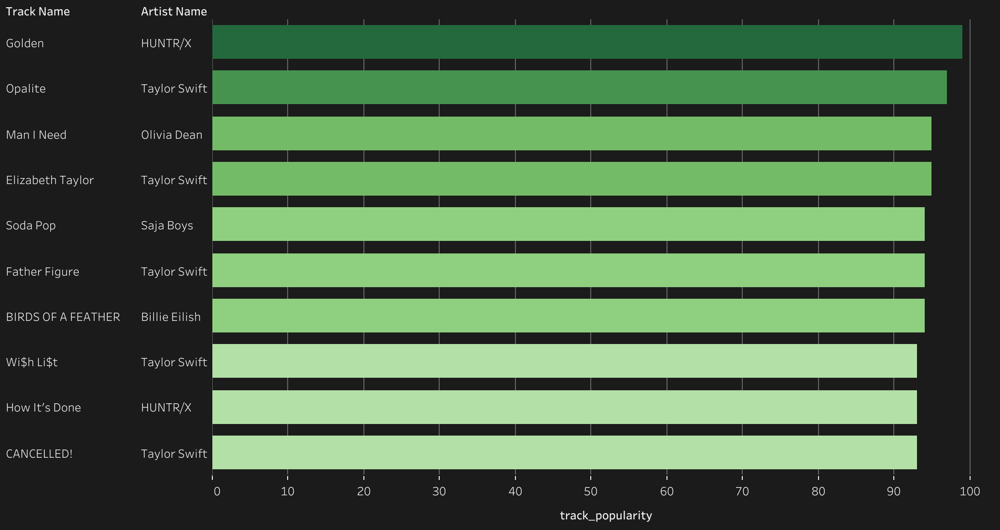
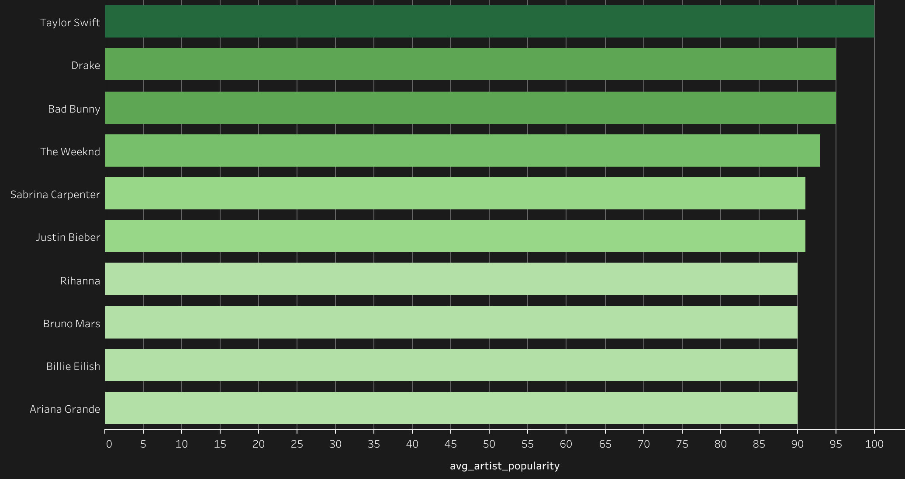
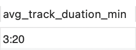
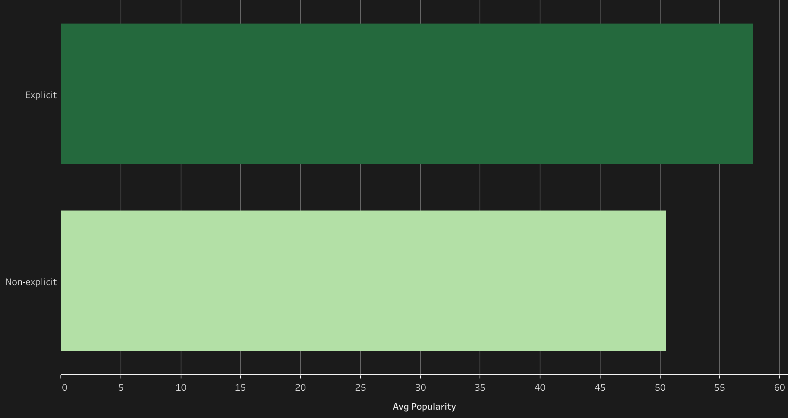

# Introduction
This project explores top streaming 🎹 **music** and **artists** on a well-known streaming platform.

Check out my SQL query here [sql_query](sql_query)

# Background
As a guy who has been around music for years. I always wanted to understand how music industry works. I decided to start this project to study the most popular songs and artists.

### The questions I asked:
1. What are the top 10 most popular songs on this platform?
2. What are the top 10 most popular artists on this platform?
3. What is the average duration of the 10 most popular tracks?
4. Is explicity affect how popular the song is?

# Tools I used
- SQL: The main tool for wrangling and analyzing data
- Tableau: The tool for visualize data
- Git & Github: Essentials for sharing my work

# The Analysis
### 1. What are the top 10 most popular songs on this platform?

To identify the top 10 most popular songs. I started by selecting track_name, artist_name and track_popularity columns. Then I ordered by track_popularity in descending order. I need to limit from after the 26th tracks because there are tracks that have misleading information like random artist name and very high popularity rate which is more the the 100 (**the popularity rate is between 0-100**).

```sql
SELECT track_name,
	artist_name,
    track_popularity
FROM spotify_data
ORDER BY track_popularity DESC
LIMIT 26, 10;
```



### 2. What are the top 10 most popular artists on this platform?
To identify the top 10 most popular artists. I started by selecting artst_name and average artist_popularity. I grouped the result by artist_name because there is an aggrigate function in it. After that I ordered the result by avg_artist_popularity in descending order and the limit the result by 10 rows. (**I use average because there are multiple tracks with the same artist**)

```sql
SELECT artist_name,
	ROUND(AVG(artist_popularity), 0) avg_artist_popularity
FROM spotify_data
GROUP BY artist_name
ORDER BY avg_artist_popularity DESC
LIMIT 10;
```



### 3. What is the average duration of the top 10 most popular tracks?
To identify the average duration of the top 10 most popular tracks. I started by putting the same query from the top 10 most popular tracks in the CTE. and I added track_duration_min in it. Then I make another CTE with the calculation of average duration. Then I found out that the track_duration_min. Then I found out that track_duration_min is in the wrong format because the seconds is more than 60 which is impossible. So I decided to convert them into the appropriate format.

```sql
WITH top_10_tracks AS (
	SELECT track_name,
		artist_name,
		track_duration_min,
		track_popularity
	FROM spotify_data
	ORDER BY track_popularity DESC
    LIMIT 26, 10
),
avg_duration AS (
	SELECT ROUND(AVG(track_duration_min), 2) AS track_duration_min
	FROM top_10_tracks
)

SELECT CONCAT(
	FLOOR(track_duration_min), ':',
    LPAD(ROUND((track_duration_min - FLOOR(track_duration_min)) * 60), 2, '0')
    ) AS avg_track_duation_min
FROM avg_duration;
```



### 4. Is explicity affect how popular the song is?
To identify if explicity affect how popular the song is or not. I started by selecting explicit column and aggrigate the track_popularity. I filter to only explicit values that only have TRUE or FALSE values because there are some rows that has inconsistant values. then I grouped the result by explicit column.

```sql
SELECT explicit,
	ROUND(AVG(track_popularity), 2) AS avg_popularity
FROM spotify_data
WHERE explicit IN ('TRUE', 'FALSE')
GROUP BY explicit;
```



# Conclusions
### Insights
From this exploritory, There are several insights I found:
1. The most popular songs duration are mostly around 3:20min.
2. explicity doesn't affect popularity since both have very close popularity rate.
3. The top 10 most popular artists are all well known artists that everyone knows so it does make sense

### Closing Thoughts
This project is an exploritory project so some insights might doesn't sound useful in some business field but it is shown how powerful these tools can do to get insights in just hours from a large messy dataset.


